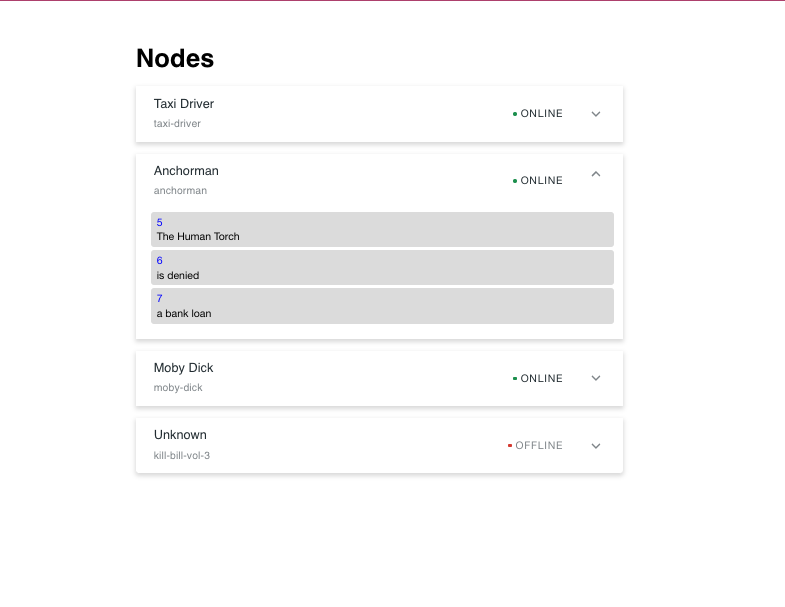

# Movie Quotes

## Installation

1. `clone repo`
2. `cd movie-quotes`
3. `nvm use`
4. `cd ./server && npm i`
5. `cd ../client && npm i`
6. `cd .. && npm start`
7. `cd ./client && npm start`
----- React app should run on localhost 3000 -----
8. `npm test`

## Description

Each movie within local database renders to the page as a list of nodes. Clicking on any individual movie node will either show a list of blocks, which are parts of quotes from that particular movie, or a missing data message if there is no data available.

Application should match the result screen provided 

## Acceptance criteria:
1. Blocks are displayed when opening up the card
2. Loading, error, empty states are displayed when appropriate
3. Implementation matches the design
4. Components are created in a reusable manner
